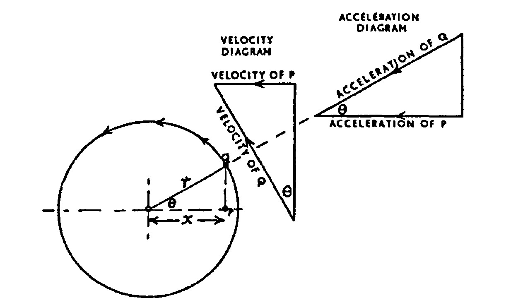

Simple Harmonic Motion: The foundation of vibration analysis. A particle undergoes SHM when its acceleration is proportional to displacement and directed toward the equilibrium position:

$$a = -\omega^2 x$$

Key relationships such as displacement, velocity, acceleration, amplitude, period, and frequency are all derived from this condition.

Simple harmonic motion is a particular form of reciprocating, or 'to-and-fro', motion in which the acceleration and the velocity of the body vary as it moves from one end of its travel to the other; the important characteristic of this motion is that the acceleration is proportional to the displacement from mid-travel (and directed towards it).

When a body moves forwards and backwards with simple harmonic motion, at one end of its oscillation the body is momentarily at rest; it receives maximum acceleration, which causes it to move with increasing velocity. The acceleration, which is proportional to the displacement from mid-travel, decreases, and its velocity increases as the body approaches mid-travel. As it passes its mid-position the acceleration is zero and the velocity is maximum. From mid-travel onwards the acceleration is negative and increasing in magnitude while the velocity decreases until, at the other end of its travel, the velocity is momentarily zero and the acceleration is maximum to return the body in the opposite direction.

If a particle is travelling around a circular path in a vertical plane at a constant speed and its shadow could be seen on a vertical screen, the shadow would move forwards and backwards with simple harmonic motion.

From a practical point of view, neglecting the effect of the angularity of the connecting rod of a reciprocating engine, the piston moves with simple harmonic motion when the crank pin travels at a constant angular velocity.

Referring to Fig. the circle represents the circular path of a particle $Q$ moving at a constant velocity; this could be the crank pin of an engine. The projection of $Q$ on to the plane of the diameter is point $P$, which could represent the relative position and motion of the piston (neglecting angularity of the connecting rod). $Q$ is moving at a constant angular velocity of $\omega$ around the circular path of radius $r$, so its linear velocity is $\omega r$. The velocity vector diagram is drawn to represent the linear velocity of $Q$ when passing the point at $\theta$ past dead centre; the horizontal component represents the velocity of $P$ at that instant. Thus:

$$\text{Velocity of } P = \text{Velocity of } Q \times \sin\theta = \omega r \sin\theta$$

The angular velocity $\omega$ is constant; therefore the acceleration of a body moving with simple harmonic motion is proportional to its displacement from mid-travel (and directed towards it).

The **AMPLITUDE** is the maximum displacement to either side of mid-travel.

The **PERIODIC TIME** is the time taken to make one complete oscillation, that is, to move completely from one end to the other and back again.

The time for $P$ to make one complete oscillation is the same time that $Q$ takes to complete one full revolution. Since the distance travelled in one revolution is $2\pi r$ and the linear velocity of $Q$ is $\omega r$:

$$\text{Periodic time} = \frac{\text{distance}}{\text{velocity}} = \frac{2\pi r}{\omega r} = \frac{2\pi}{\omega}$$

Since the acceleration of $P$ is proportional to its displacement from mid-travel:

$$\text{acceleration} = \omega^2 \times \text{displacement}$$

it follows that:

$$\omega = \sqrt{\frac{\text{acceleration}}{\text{displacement}}}$$

Substituting into the expression for periodic time:

$$\text{Periodic time} = \frac{2\pi}{\omega} = \frac{2\pi}{\sqrt{\dfrac{\text{acceleration}}{\text{displacement}}}}$$

This expression gives the periodic time for any body moving with simple harmonic motion.

The **FREQUENCY** is the number of complete oscillations made in one second.

If $t$ = periodic time (s), then:

$$\text{Frequency} = \frac{1}{t} \quad \text{oscillations per second}$$

## Free Undamped Vibration

### Mass-Spring System

The simplest model: a mass $m$ on a spring of stiffness $s$:

$$\omega_n = \sqrt{\frac{s}{m}} \qquad f_n = \frac{1}{2\pi}\sqrt{\frac{s}{m}}$$

**Derivation via the general SHM periodic time formula** (Reed's Vol. 2):

Since acceleration is proportional to displacement in any SHM system:

$$T = 2\pi\sqrt{\frac{\text{displacement}}{\text{acceleration}}}$$

For a spring-mass system the restoring force is $F = sx$, so by Newton's second law $a = sx/m$. Substituting:

$$T = 2\pi\sqrt{\frac{x}{sx/m}} = 2\pi\sqrt{\frac{m}{s}}$$

This is the **general SHM formula** — it applies to any oscillating system (spring, pendulum, piston) without needing to know $\omega$ explicitly, provided displacement and acceleration are known.

### Simple Pendulum

$$f_n = \frac{1}{2\pi}\sqrt{\frac{g}{L}}$$

### Equivalent Stiffness

Springs in series and parallel are reduced to a single equivalent stiffness before applying the standard formulae:

$$s_{\text{series}} = \frac{s_1 s_2}{s_1 + s_2} \qquad s_{\text{parallel}} = s_1 + s_2$$

<!-- ## Energy Method (Rayleigh's Method)

An alternative to force methods — equating maximum kinetic energy to maximum potential energy to find the natural frequency. Particularly useful where writing equations of motion is complex:

$$\frac{1}{2}mv_{\max}^2 = \frac{1}{2}sx_{\max}^2$$

## Damped Free Vibration

In practice, energy is dissipated. A viscous damping force proportional to velocity is assumed:

$$F_d = -c\dot{x}$$

The **damping ratio** $\zeta$ determines the character of the motion:

$$\zeta = \frac{c}{2\sqrt{ms}}$$

| Condition   | Behaviour                                               |
|-------------|---------------------------------------------------------|
| $\zeta < 1$ | Underdamped — oscillates with decaying amplitude        |
| $\zeta = 1$ | Critically damped — returns to rest without oscillation |
| $\zeta > 1$ | Overdamped — sluggish return to rest                    |

The **damped natural frequency** is reduced from the undamped value:

$$\omega_d = \omega_n\sqrt{1 - \zeta^2}$$

## Forced Vibration (Undamped)

When a harmonic exciting force $F = F_0 \sin(\omega t)$ is applied, the steady-state amplitude is:

$$X = \frac{F_0/s}{1 - (\omega/\omega_n)^2}$$

Note that above resonance this expression yields a negative value, indicating that the response is 180° out of phase with the excitation; the physical amplitude is the modulus $|X|$.

**Resonance** occurs when $\omega \to \omega_n$, causing theoretically infinite amplitude.

## Forced Vibration (Damped)

Damping limits the amplitude at resonance. The **dynamic magnification factor (DMF)** gives the ratio of dynamic to static deflection:

$$\text{DMF} = \frac{1}{\sqrt{\left[1-\left(\dfrac{\omega}{\omega_n}\right)^2\right]^2 + \left[2\zeta\dfrac{\omega}{\omega_n}\right]^2}}$$

At resonance ($\omega = \omega_n$), the DMF reduces to:

$$\text{DMF}_{\text{resonance}} = \frac{1}{2\zeta}$$

## Whirling of Shafts

A rotating shaft has a **critical speed** at which it deflects violently — directly analogous to resonance. The critical (whirling) speed corresponds to the natural frequency of transverse vibration:

$$N_c = \frac{30}{\pi}\sqrt{\frac{g}{\delta_{st}}}$$

where $\delta_{st}$ is the static deflection of the shaft under its own (or the rotor's) weight. Operating speeds should be well clear of $N_c$. -->

<!-- ## Summary of Equations

| Concept                         | Equation                                                              |
|---------------------------------|-----------------------------------------------------------------------|
| SHM condition                   | $a = -\omega^2 x$                                                     |
| Natural frequency (spring-mass) | $\omega_n = \sqrt{s/m}$, $T = 2\pi\sqrt{m/s}$                        |
| Natural frequency (pendulum)    | $f_n = \frac{1}{2\pi}\sqrt{g/L}$                                      |
| Damping ratio                   | $\zeta = c/(2\sqrt{ms})$                                              |
| Damped natural frequency        | $\omega_d = \omega_n\sqrt{1-\zeta^2}$                                 |
| Resonance condition             | $\omega = \omega_n$                                                   |
| DMF (damped forced)             | $1/\sqrt{[1-r^2]^2+[2\zeta r]^2}$, where $r=\omega/\omega_n$         |
| Critical shaft speed            | $N_c = (30/\pi)\sqrt{g/\delta_{st}}$                                  | -->

## Summary

All vibration problems reduce to understanding the interplay between **stiffness** (restoring force), **mass** (inertia), and **damping** (energy dissipation). Resonance avoidance and the role of damping in controlling amplitudes are the central practical concerns for mechanical design.
