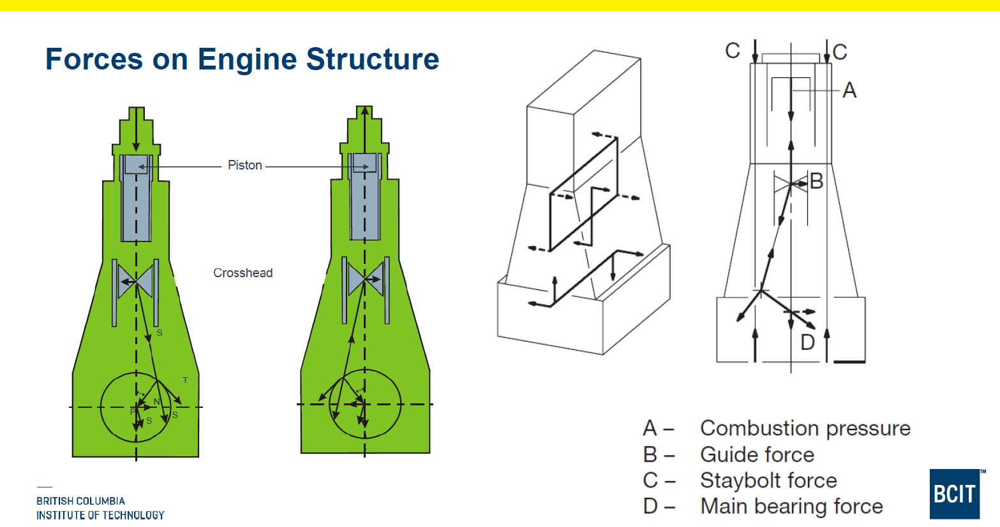

# Vibration

Any elastically-coupled shaft, or other systems, will have one or more natural frequencies, which, if excited, can build up to an amplitude which is perfectly capable of breaking crankshafts. 'Elastic' in this sense means that displacement or a twist from rest creates a force or torque tending to return the system to its position of rest, and which is proportional to the displacement. An elastic system, once set in motion in this way, will go on swinging, or vibrating, about its equilibrium position forever, in the theoretical absence of any damping influence. The resulting time/amplitude curve is exactly represented by a sine wave; that is, it is sinusoidal.

Ship machinery installations have two principal sources of excitation: the main engine(s) and the propeller(s). The two components are essentially linked by elastic shaft systems, and may also include gearboxes and elastic couplings. The whole system is supported in flexible hull structures, and the forms of vibration possible are, therefore, diverse. The greater complexity of vibration problems dictates a larger number of calculations to ensure satisfactory vibration levels from projected installations. For optimum results, the vibration performance of the plant has to be investigated for all anticipated operational modes.

## Critical Speed

The critical speed of an engine is the rotational speed at which the engine's components begin to vibrate in an unstable manner. There are a number of forces acting on an engine from each cylinder, and these can vary in magnitude and direction as the engine rotates. The turning moment acting on the crankshaft, and the vibration effect it produces, is complex, and repeated at every revolution. Like any other repeating curve, it can be represented by a series of sine waves, each with different amplitudes and phases to the basic underlying sine wave. Each of the sine waves, or harmonics, can excite the free natural frequency of the engine system, and the speeds at which the excitation takes place are called the critical speeds.

There are many critical speeds, but most are outside of the normal operating speed of the engine. The critical speeds are distinguished from each other by the number of vibrations that occur during each engine crankshaft revolution. At the first critical speed, there is one vibration at each crankshaft revolution, and this is known as the first order vibration. At the second critical speed, there are two vibrations during each revolution of the crankshaft, and this is the second order vibration. For a fourth order vibration, there would be four vibrations during each revolution of the crankshaft. The orders of vibration that are significant for a particular crankshaft, and are likely to produce large vibration amplitudes, depend on the number of engine cylinders. The important orders are usually a multiple of the number of cylinders, so for a four-cylinder engine, the 4th, 8th, 12th, and 16th orders of vibration will be significant, and likely to present vibration problems if they occur in the engine operating speed range. For a nine-cylinder engine, the 9th and 18th orders of vibration will be significant, although there is less likelihood of the engine operating at a speed where the 9th order vibration is likely to occur. The firing order of the cylinders is influential in reducing the crankshaft vibration.
